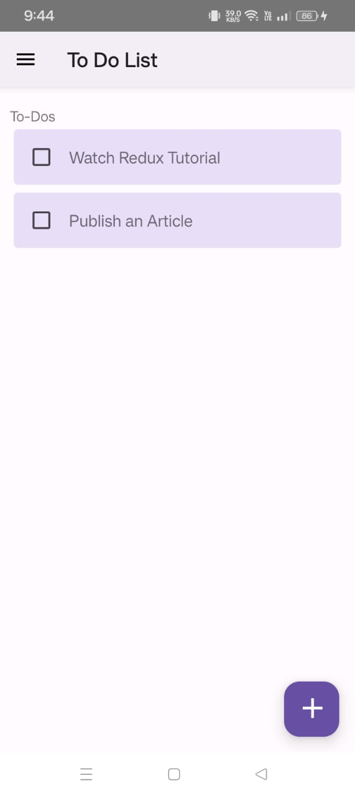
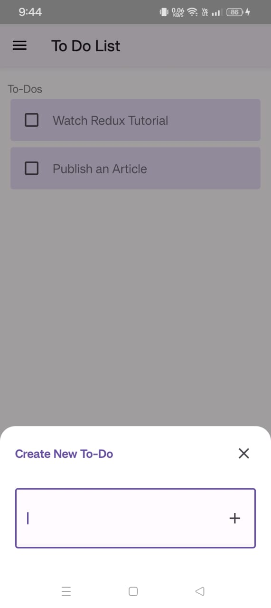
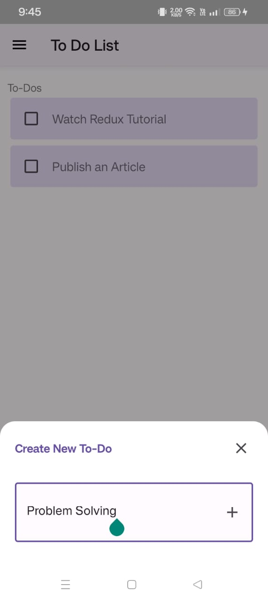
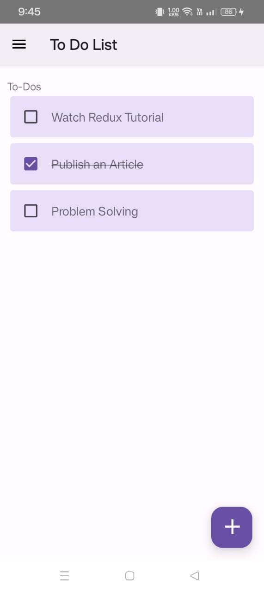

# Simple Note-Taking App

A simple note-taking app built with React Native, React Navigation, and Redux Toolkit.

## Introduction

This project is a simple note-taking app created as a learning exercise to explore React Navigation for navigation management and Redux Toolkit for state management in a React Native application.

## Features

- Add new to-dos
- Mark to-dos as done
- View list of to-dos

## Technologies Used

- React Native
- React Navigation
- Redux Toolkit

## Installation

1. Clone the repository: git clone https://github.com/rubayatkhan95/note-taking-app.git
2. Install dependencies:
```bash
   cd your-repo
   npm install
   npm install react-navigation @react-navigation/native
   npm install react-native-reanimated react-native-gesture-handler react-native-screens react-native-safe-area-context @react-native-community/masked-view
   npm install @react-navigation/stack
   npm install @react-navigation/bottom-tabs
   npm install @reduxjs/toolkit react-redux
```
## Usage

1. Open the app on your device or emulator.
2. Add new to-dos by tapping the "+" button.
3. Mark to-dos as done by tapping on them.
4. View the list of to-dos.

## Screenshots

| Screenshot 1 | Screenshot 2 | Screenshot 3 | Screenshot 4 |
|---------------|---------------|---------------|---------------|
|  |  |  |  |


   
    
